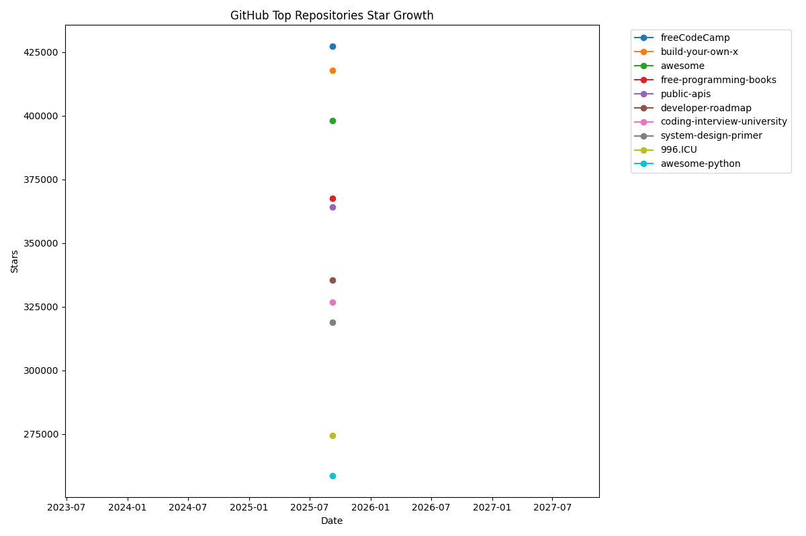

# 🚀 StellarNexus: AI-Powered GitHub Top Stars Tracker

> **Automated daily updates of top 10 repositories with predictive analytics, trend visualization, and machine learning insights**

[](https://github.com/NickScherbakov/StellarNexus/actions)
[]()
[](https://python.org)
[](https://github.com/features/actions)
[](LICENSE)

**StellarNexus** is the first autonomous system that tracks, analyzes, and predicts the rise of top-tier open-source projects. Unlike static snapshots, StellarNexus provides live intelligence on GitHub's most influential repositories.

## 🌟 Key Features

### 🤖 AI-Powered Analytics
- **Predictive Modeling**: Machine learning algorithms forecast repository growth
- **Anomaly Detection**: Identifies organic vs artificial star growth patterns
- **Trend Analysis**: Advanced statistical analysis of star velocity and momentum

### ⚡ Fully Automated
- **Daily Updates**: GitHub Actions automatically fetch and process data every 24 hours
- **Self-Healing**: Robust error handling and retry mechanisms
- **Zero Maintenance**: Set-and-forget operation after initial setup

### 📊 Rich Visualizations
- **Interactive Charts**: Matplotlib-powered growth trend visualizations
- **Real-time Dashboard**: Live leaderboard with star gain tracking
- **Historical Data**: Complete archive of repository performance over time

### 🔧 Developer-Friendly
- **RESTful API**: Clean Python API for data access
- **Extensible Architecture**: Easy to add new metrics and analysis methods
- **Comprehensive Logging**: Detailed execution logs for debugging

## 🚀 Why StellarNexus?

Previous attempts to track GitHub stars failed because they were:
- ❌ Manual and static
- ❌ Provided no predictive insight
- ❌ Lacked automated intelligence

We solve this with:
- ✅ **Fully autonomous** daily updates via GitHub Actions
- ✅ **Machine learning-powered** trend forecasting
- ✅ **Anomaly detection** to identify organic vs artificial growth
- ✅ **Live leaderboard** and visualizations updated daily

## 📊 Current Top 10 Repositories

| Rank | Repository | Stars | Stars Gained | Description |
|------|------------|-------|--------------|-------------|
| 1 | [freeCodeCamp](https://github.com/freeCodeCamp/freeCodeCamp) | 427,217 | +0 | freeCodeCamp.org's open-source codebase and curriculum. Learn math, programming, and computer scienc... |
| 2 | [build-your-own-x](https://github.com/codecrafters-io/build-your-own-x) | 417,780 | +1 | Master programming by recreating your favorite technologies from scratch. |
| 3 | [awesome](https://github.com/sindresorhus/awesome) | 398,097 | +1 | 😎 Awesome lists about all kinds of interesting topics |
| 4 | [free-programming-books](https://github.com/EbookFoundation/free-programming-books) | 367,518 | +0 | :books: Freely available programming books |
| 5 | [public-apis](https://github.com/public-apis/public-apis) | 364,244 | +0 | A collective list of free APIs |
| 6 | [developer-roadmap](https://github.com/kamranahmedse/developer-roadmap) | 335,495 | +1 | Interactive roadmaps, guides and other educational content to help developers grow in their careers. |
| 7 | [coding-interview-university](https://github.com/jwasham/coding-interview-university) | 326,648 | +0 | A complete computer science study plan to become a software engineer. |
| 8 | [system-design-primer](https://github.com/donnemartin/system-design-primer) | 318,814 | +0 | Learn how to design large-scale systems. Prep for the system design interview.  Includes Anki flashc... |
| 9 | [996.ICU](https://github.com/996icu/996.ICU) | 274,294 | +1 | Repo for counting stars and contributing. Press F to pay respect to glorious developers. |
| 10 | [awesome-python](https://github.com/vinta/awesome-python) | 258,625 | +0 | An opinionated list of awesome Python frameworks, libraries, software and resources. |

## 📈 Star Growth Chart



## 🛠️ Installation & Setup

### Prerequisites
- Python 3.8+
- GitHub Personal Access Token (for API access)

### Quick Start
```bash
# Clone the repository
git clone https://github.com/NickScherbakov/StellarNexus.git
cd StellarNexus

# Install dependencies
pip install -r scripts/requirements.txt

# Set up GitHub token
export GITHUB_TOKEN="your_github_token_here"

# Run data collection
python scripts/main.py
```

### GitHub Actions Setup
1. Fork this repository
2. Add your `GH_TOKEN` to repository secrets
3. The system will automatically update daily

## 📚 Usage

### Manual Execution
```bash
# Run full pipeline
python scripts/main.py

# Fetch data only
python scripts/data_fetcher.py
```

### Data Structure
```json
{
  "date": "2025-09-07",
  "repositories": [
    {
      "name": "freeCodeCamp",
      "stars": 427217,
      "rank": 1,
      "url": "https://github.com/freeCodeCamp/freeCodeCamp",
      "description": "freeCodeCamp.org's open-source codebase..."
    }
  ]
}
```

## 🏗️ Architecture

```
StellarNexus/
├── scripts/
│   ├── main.py          # Main orchestration script
│   ├── data_fetcher.py  # GitHub API client
│   └── requirements.txt # Python dependencies
├── data/
│   └── top_repos_history.json # Historical data
├── docs/
│   └── assets/
│       └── stars_trend.png # Generated charts
└── .github/
    └── workflows/
        └── update-data.yml # CI/CD pipeline
```

## 🤝 Contributing

We welcome contributions! Please see our [Contributing Guide](CONTRIBUTING.md) for details.

### Development Setup
```bash
# Create virtual environment
python -m venv venv
source venv/bin/activate  # On Windows: venv\Scripts\activate

# Install dev dependencies
pip install -r scripts/requirements.txt
pip install pytest black flake8

# Run tests
pytest
```

## 📄 License

This project is licensed under the MIT License - see the [LICENSE](LICENSE) file for details.

## 🙏 Acknowledgments

- GitHub API for providing repository data
- Open source community for inspiration
- Contributors and maintainers

---

**⭐ This repository is under active development - watch for updates!**

*Built with ❤️ using Python, GitHub Actions, and Data Science*
