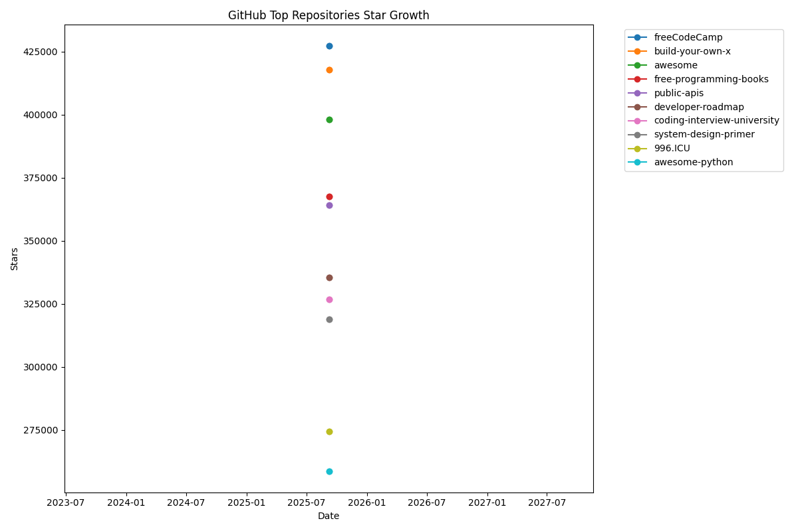

# GitHub Top Stars Tracker

> AI-Powered Predictive Analytics for the GitHub Universe

**StellarNexus** is the first autonomous system that tracks, analyzes, and predicts the rise of top-tier open-source projects. Unlike static snapshots, StellarNexus provides live intelligence on GitHub's most influential repositories.

## 🚀 Why StellarNexus?

Previous attempts to track GitHub stars failed because they were:
- ❌ Manual and static
- ❌ Provided no predictive insight
- ❌ Lacked automated intelligence

We solve this with:
- ✅ **Fully autonomous** daily updates via GitHub Actions
- ✅ **Machine learning-powered** trend forecasting
- ✅ **Anomaly detection** to identify organic vs artificial growth
- ✅ **Live leaderboard** and visualizations updated daily

## 📊 Current Top 10 Repositories

| Rank | Repository | Stars | Stars Gained | Description |
|------|------------|-------|--------------|-------------|
| 1 | [freeCodeCamp](https://github.com/freeCodeCamp/freeCodeCamp) | 427,217 | +0 | freeCodeCamp.org's open-source codebase and curriculum. Learn math, programming, and computer scienc... |
| 2 | [build-your-own-x](https://github.com/codecrafters-io/build-your-own-x) | 417,780 | +1 | Master programming by recreating your favorite technologies from scratch. |
| 3 | [awesome](https://github.com/sindresorhus/awesome) | 398,097 | +1 | 😎 Awesome lists about all kinds of interesting topics |
| 4 | [free-programming-books](https://github.com/EbookFoundation/free-programming-books) | 367,518 | +0 | :books: Freely available programming books |
| 5 | [public-apis](https://github.com/public-apis/public-apis) | 364,244 | +0 | A collective list of free APIs |
| 6 | [developer-roadmap](https://github.com/kamranahmedse/developer-roadmap) | 335,495 | +1 | Interactive roadmaps, guides and other educational content to help developers grow in their careers. |
| 7 | [coding-interview-university](https://github.com/jwasham/coding-interview-university) | 326,648 | +0 | A complete computer science study plan to become a software engineer. |
| 8 | [system-design-primer](https://github.com/donnemartin/system-design-primer) | 318,814 | +0 | Learn how to design large-scale systems. Prep for the system design interview.  Includes Anki flashc... |
| 9 | [996.ICU](https://github.com/996icu/996.ICU) | 274,294 | +1 | Repo for counting stars and contributing. Press F to pay respect to glorious developers. |
| 10 | [awesome-python](https://github.com/vinta/awesome-python) | 258,625 | +0 | An opinionated list of awesome Python frameworks, libraries, software and resources. |

## 📈 Star Growth Chart

---

**⭐ This repository is under active development - watch for updates!**
